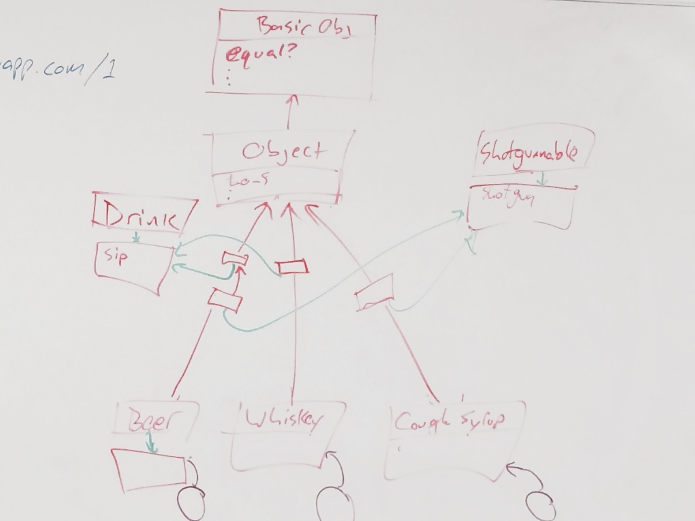

The Ruby Object Model
=====================

This is where you learn how Ruby works.
This is why the answers I give you are what they are.


Lesson Plan (for Object Model 1)
--------------------------------

* [Quiz](https://quizzes-ruby-object-model.herokuapp.com/1) <-- y'all should have memorized this shit!
* Play with hashes (linked-list style)
* Definitions
* [Quiz](https://quizzes-ruby-object-model.herokuapp.com/2)
* Anything could happen here! (we can do modules / singleton classes, or we could do [challenges](https://gist.github.com/JoshCheek/ad9f70a6d855be9ed50d))
* [Quiz](https://quizzes-ruby-object-model.herokuapp.com/3)


Lesson Plan for (Object Model 2 / Modules)
------------------------------------------

* Redo quiz from 1
* Reiterate the structure by showing them as hashes and trying to get various interesting things out, eg "from `some_user`, can you get":
  * the `@age`:          `123`
  * the `birthday` code: `"@age += 1"`
  * the `to_s` code:     `"...to_s..."`
  * the `equal?` code:   `"...equal?..."`
* Present a challenge:
  * Give me a noun (becomes class)
  * What are two things it can do? (becomes methods)
  * What else does the first thing, but not the second? (another class, copy/paste the method)
  * What else does the second thing, but not the first? (another class, copy/paste the method)
  * Have them work together to figure out how to reduce the duplication
* Talk about the 2 roles of modules


Definitions
-----------

### Any time you have a name, you have a hash

Any time you refer to something by name, you can think of the name as a "key",
and the thing you are referring to as a "value". Then you can represent this
with anything which can represent key/value pairs.
By far the most common way to do this, especially in Ruby, is to use a hash.
And we find that this is what makes up the things we see in Ruby.


### Objects -- the nouns of Ruby

An object is a hash with symbols for keys.
It has the keys `:class`, and `:instance_variables`.

**The purpose of an object is to store data, via its instance variables.**

If we think of the object as a **noun**, we need some **verbs** to act on it!
The verbs are methods, and those are stored in classes, not objects,
so we give each object the `:class` key,
in order to locate the methods we can call on it.

```ruby
{ class:             nil, # in reality, not nil, but one of the hashes defined below
  instance_variables: {
    :@year  => 1994,      # some example instance variables.
    :@make  => "Toyota",  # in reality, the values are other objects (other hashes like this one)
    :@model => "Camry",   # but for simplicity, I'll write them like this.
  }
}
```

### Classes -- the verbs of Ruby

A class is a hash with symbols for keys.
It has the keys `:superclass`, `:methods`, and `:constants`.

A class is also an object, which means that it also has the keys that objects have:
`:class`, and `:instance_variables`.

**The purpose of the class is to store the instructions for operating on an object.**

Each car's year may be different, which is why we store it on the object.
But each car's set of steps for incrementing the odometer are the same: `@odometer += 1`
These are methods... functions... steps... instructions... **verbs**.

If we had put them on the car itself, there would be frivolously
redundant sets of instructions on every object.
So we put the methods in one common place that all cars can go to to find: the class.

```ruby
{ # class stuff
  superclass: nil, # Look here if I don't have the method you want.
  methods:    {},  # keys are method names, as symbols, values are the method bodies
  constants:  {},  # keys are constant names, as symbols (eg :Object, :String),
                   # values are any Ruby object (ie any hash with a class and superclass)

  # object stuff
  class:              nil,
  instance_variables: {},
}
```

Note that method bodies are instructions to Ruby to do things like
"get an instance variable", "set a local variable", "call a method", etc.
If you want to see what they look like, here is some code to do it:
[https://gist.github.com/JoshCheek/a8e9dbb6f54fd1a69216](https://gist.github.com/JoshCheek/a8e9dbb6f54fd1a69216)


### Inheritance

A class "inherits" from whatever its superclass points to.
All it means is that the class can call those methods,
because that's where it will go looking next.


### Bindings -- sentences, maybe, lol

A binding is a hash with symbols for keys.
It has the keys `:self`, `:local_variables`, `:return_value`, `:next_binding`.

**The purpose of a binding is to store the information we need to actually execute the code.**

If you think of objects as **nouns** and classes as **verbs**, the binding might be your **sentence**.
If you think of objects as **ingredients** and classes as **recipes**, the binding might be your **kitchen**, your counter, a mixing bowl, your oven, a cutting board... anything which facilitates the preparation of the food according to the recipe.

* If a method says to set an instance variable,
  we need to know which object to set it on.
  So the binding has a `:self`.
* A method might need a variable that nothing else needs.
  So the binding has a hash of `:local_variables`.
* When the method is finished, it wants to send the result of its calculations
  back to the code that called it, so the binding has a `:return_value`.
* When the method is done being executed, we want the code that called it to resume execution,
  so the binding has a `:next_binding` -- the one that called it.

```ruby
{ self:            nil,      # where to set/get instance variables, find `self`, and call "implicit" methods
  local_variables: {num: 1}, # keys are variable names, values are objects (things with classes and instance variables)
  return_value:    nil,
  next_binding:    nil,
}
```

### The stack is a linked list of bindings

The stack points at the "head" of a linked list,
this is where we are currently executing code.

When we call a method, we put a new binding on with:

* `:self` set to the object we called the method on
* `:local_variables` will have keys of the argument names, and values of whatever we passed it.
* `:return_value` set to `nil` (this is why empty methods return `nil`)
* `:next_binding` set to the binding that called it

When we leave a method, we remove the binding at the head of the list,
causing us to resume executing code at the old binding.

We call it a stack, because it nicely fits the metaphor of... stacks of things.
If you have a stack of pancakes, and you put another one on (often called pushing),
then you couldn't get to the one that used to be on top, until you took it back off
(often called popping). Anything with this behaviour of
_"the **Last** thing I put **in** is the **first** thing I get **out**"_ is a stack.
In our case, it's done with a linked list of hashes.


### Modules

A module is a class without the superclass.

The purpose of a module is:

* store constants for namespacing
* hold methods for "mixing into" classes

```ruby
{ # class stuff
  methods:    {},  # keys are method names, as symbols, values are the method bodies
  constants:  {},  # keys are constant names, as symbols (eg :Object, :String),
                   # values are any Ruby object (ie any hash with a class and superclass)

  # object stuff
  class:              nil,
  instance_variables: {},
}
```


## Objects are just linked lists

Consider the following code.
I've added a file showing it's hash structure in [`user_hash.rb`](https://github.com/JoshCheek/object-model-hash-style/blob/master/user_hash.rb)
Place that file side-by-side with [`linked_list_hash.rb`](https://github.com/JoshCheek/object-model-hash-style/blob/master/linked_list_hash.rb)
:)

```ruby
class User
  def initialize(age)
    @age = age
  end

  def birthday
    @age += 1
  end
end

some_user = User.new 123
some_user # => #<User:0x007f933c1dd6d0 @age=123>
some_user.birthday
some_user # => #<User:0x007f933c1dd6d0 @age=124>
```


## Namespacing

The problem:

* Our class could have the same name as another class.
* This would cause them to accidentally overwrite each other's methods!

The solution:

We need some place where we can put our classes that won't conflict.
Since modules can hold constants, we might create a module to hold all of our classes.
We call this a namespace.

```ruby
# If I define a class Parser, I conflict with this thing:
require 'parser/ruby22'
Parser::Ruby22.parse(":hello_world") # => (sym :hello_world)


# So I'll put my Parser class into a namespace
module Headcount
  class Parser
    def initialize(data_dir)
      @data_dir = data_dir
    end
    def parse
      "here is some data I got from #{@data_dir}"
    end
  end
end

Headcount::Parser.new("./data").parse # => "here is some data I got from ./data"


# I'm not even the first to do it!
require 'yaml'
YAML::Parser.new(Psych::TreeBuilder.new).parse(":hello_world").handler.root.to_ruby.first # => :hello_world

require 'rss'
rss = '<?xml version="1.0" ?><rss version="2.0"><channel><title>Mah Blog</title><link>http://github.com/JoshCheek</link><description>ADD\'d out ramblings, mostly</description></channel></rss>'
RSS::Parser.parse(rss).channel.description # => "ADD'd out ramblings, mostly"
```


## Mixins

The problem:

* We want to be able to sip beer, or to shotgun it.
* We want to be able to sip whiskey
* We want to be able to shotgun cough syrup

The solution:

This means we have duplicated methods.
We know we can address it by pulling into a superclass.
But out beer class will have to have two superclasses
(or we accidentally give methods to classes that can't support them).
So we make a class whose job is to be a bag of methods,
and we `include` it wherever it belongs.
This causes Ruby to make a new class and set it as the superclass,
and instead of giving it its own methods, its methods point at our bag of methods.
This means that everything still works the same way it always has,
but we get to put those methods into any inheritance hierarchy we want!
The "bag of methods" is our module.



```ruby
module Drink
  def sip(amount)
    @ounces -= amount
  end
end

module Shotgunnable
  def shotgun
    @ounces = 0
  end
end

class Beer
  include Drink
  include Shotgunnable
  def initialize(ounces)
    @ounces = ounces
  end
end

class Whiskey
  include Drink
  def initialize(ounces)
    @ounces = ounces
  end
end

class CoughSyrup
  include Shotgunnable
  def initialize(ounces)
    @ounces = ounces
  end
end

Beer.new(12).sip(1)        # => 11
Whiskey.new(1.5).sip(0.5)  # => 1.0
Beer.new(1.5).shotgun      # => 0
CoughSyrup.new(4).shotgun  # => 0
```

The same thing, in terms of hashes:

```ruby
# define our modules
drink_module        = {methods: {sip:     '@ounces -= 1'}}
shotgunnable_module = {methods: {shotgun: '@ounces = 0' }}

# define our classes
basic_obj_class   = {superclass: nil,             methods: {}}
object_class      = {superclass: basic_obj_class, methods: {}}
beer_class        = {superclass: object_class,    methods: {}}
whiskey_class     = {superclass: object_class,    methods: {}}
cough_syrup_class = {superclass: object_class,    methods: {}}

# include the modules
beer_class[:superclass]        = {superclass: beer_class[:superclass],        methods: drink_module[:methods]}
beer_class[:superclass]        = {superclass: beer_class[:superclass],        methods: shotgunnable_module[:methods]}
whiskey_class[:superclass]     = {superclass: whiskey_class[:superclass],     methods: drink_module[:methods]}
cough_syrup_class[:superclass] = {superclass: cough_syrup_class[:superclass], methods: shotgunnable_module[:methods]}

# some instances of our classes
beer    = {class: beer_class}
whiskey = {class: whiskey_class}
syrup   = {class: cough_syrup_class}

# and all our instances have access as we expect!
beer[:class][:superclass][:superclass][:methods][:sip] # => "@ounces -= 1"
beer[:class][:superclass][:methods][:shotgun]          # => "@ounces = 0"
whiskey[:class][:superclass][:methods][:sip]           # => "@ounces -= 1"
syrup[:class][:superclass][:methods][:shotgun]         # => "@ounces = 0"
```
